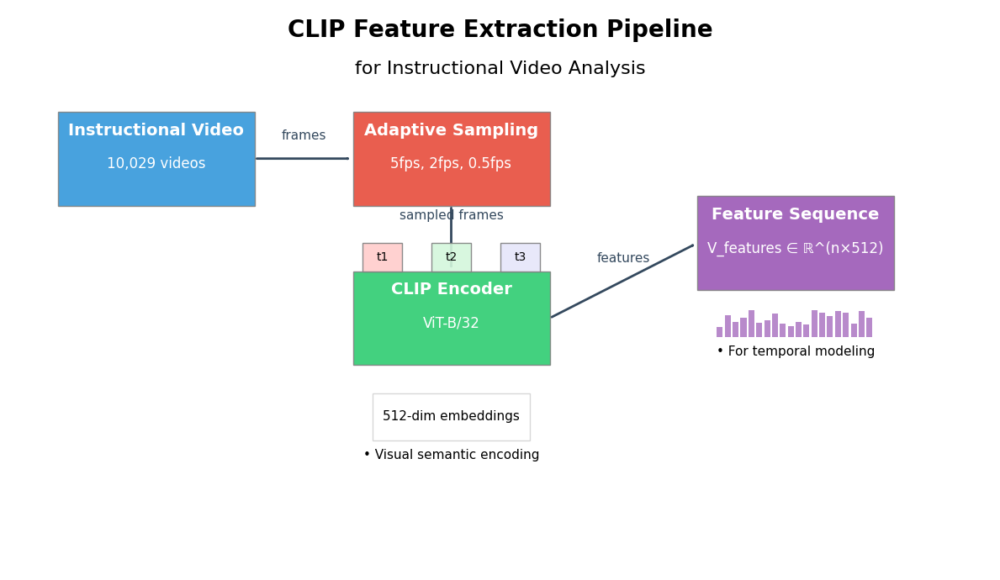
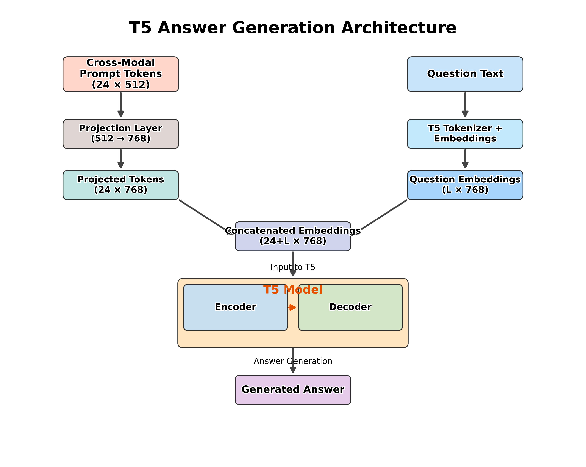

## Project Overview

This repository implements a full pipeline for procedural video question answering, from raw videos to temporal modeling, cross-modal fusion, and T5-based answer generation, along with visualization and evaluation utilities.

### Getting Started

#### 1. Clone the repository

```bash
git clone https://github.com/krantiprakash/Task-verification-in-Procedural-videos.git
cd MTP1
```

#### 2. Create and activate a virtual environment (recommended)

```bash
python -m venv .venv
.venv\Scripts\activate (for windows)
source venv/bin/activate (for linux)
```

#### 3. Install dependencies

```bash
pip install -r requirements.txt
```

#### 4. Run the pipeline components

Prepare splits (from raw `StepsQA.json`):
```bash
python dataset_split.py
```

Extract CLIP features:
```bash
python clip_feature.py
```

Train TimeSformer and export temporal features:
```bash
python timesformer_modeling.py
```

Train cross-modal fusion:
```bash
python cross_model_fusion.py
```

Train + evaluate T5 QA model:
```bash
python t5_answer_generation.py
```

<!-- ### Pipeline Stages
- **Dataset splitting (`dataset_split.py`)**: Creates stratified train/validation/test JSON splits from `StepsQA.json` and verifies video coverage.
- **CLIP feature extraction (`clip_feature.py`)**: Samples video frames adaptively around annotated steps, extracts CLIP image embeddings, and optionally visualizes sampling statistics.
- **Temporal modeling with TimeSformer (`timesformer_modeling.py`)**: Trains a TimeSformer model on CLIP features to produce temporal embeddings and saves per-split temporal feature files.
- **Temporal analysis and visualization (`timesformer_visualization.py`)**: Visualizes TimeSformer attention, temporal embedding structure (t-SNE/PCA), and training curves from TensorBoard logs.
- **Temporal evaluation (`timesformer_evaluation.py`)**: Evaluates temporal embeddings for intra/inter-class consistency and alignment with procedural step boundaries.
- **Cross-modal fusion (`cross_model_fusion.py`)**: Trains a contrastive video–text fusion model that produces prompt tokens for T5, with attention visualizations and early stopping.
- **Answer generation with T5 (`t5_answer_generation.py`)**: Uses frozen cross-modal prompts plus T5 to generate natural-language answers for video QA, with rich evaluation metrics and logging.
- **Shared utilities (`utils.py`)**: Common helpers for logging, seeding, data loading, metrics, visualization, experiment management, and early stopping. -->

### Pipeline Architecture
*High-level flow from raw videos to answer generation.*


### Component Architectures

#### CLIP Feature Extraction (`clip_feature.py`)
- Uses the CLIP image encoder to turn adaptively sampled video frames into frame-level embeddings, conditioned on annotated procedural steps.
- Stores per-video feature tensors plus timestamps and can generate diagnostic visualizations (sampled-frame grids, t-SNE plots, and frame-count histograms).


#### TimeSformer Temporal Modeling (`timesformer_modeling.py`)
- Feeds CLIP frame embeddings into a TimeSformer with relative positional encodings and hierarchical attention pooling to learn compact temporal video embeddings.
- Trains via a self-supervised next-frame reconstruction objective and then exports temporal feature `.pt` files for train/validation/test splits.


#### Cross-Modal Fusion (`cross_model_fusion.py`)
- Uses a Transformer to turn step descriptions into text embeddings and learns to match them to TimeSformer video embeddings with a contrastive loss (InfoNCE).
- Produces a sequence of prompt tokens per video that captures the joint video–text information and can be visualized via attention heatmaps and timelines.


#### T5 Answer Generation (`t5_answer_generation.py`)
- Freezes the cross-modal fusion and text encoder, projects their prompt tokens into the T5 embedding space, and concatenates them with question embeddings.
- Fine-tunes T5 to generate open-ended answers for procedural video QA, and evaluates with BLEU, ROUGE, METEOR, exact match, F1, and optional BERTScore.


### Performance
{Performance:} BERTScore F1: 78.34\%, BLEU: 37.13\%, ROUGE-L: 59.09\%, METEOR: 59.10\%, EM: 18.33\%}

### Sample Answers Generated by the Vision–Language Model

Example 1:  
Question: Did you remove the toy and paper bed from the hamster cage?  
Reference: Yes, I removed the toy and paper bed from the hamster cage.  
Generated: Yes, the toy and paper bed have been removed from the hamster cage.  
BLEU: 0.5411, ROUGE-L: 0.8000, METEOR: 0.9086, Exact Match: 0.0000, F1: 0.8889  

Example 10:  
Question: How do you secure the packing paper around the gift box?  
Reference: Stick with the tape and wrap.  
Generated: Stick with the tape and wrap.  
BLEU: 1.0000, ROUGE-L: 1.0000, METEOR: 0.9985, Exact Match: 1.0000, F1: 1.0000  

Example 31:  
Question: What should you put on the window?  
Reference: The sticker should be put on the window.  
Generated: You should put the sticker on the window.  
BLEU: 0.3814, ROUGE-L: 0.6250, METEOR: 0.8333, Exact Match: 0.0000, F1: 0.8750  

Example 34:  
Question: When do you tear off the other side of the sticker?  
Reference: After pressing the sticker.  
Generated: After pressing the sticker on the window.  
BLEU: 0.3656, ROUGE-L: 0.7273, METEOR: 0.7019, Exact Match: 0.0000, F1: 0.8333  
