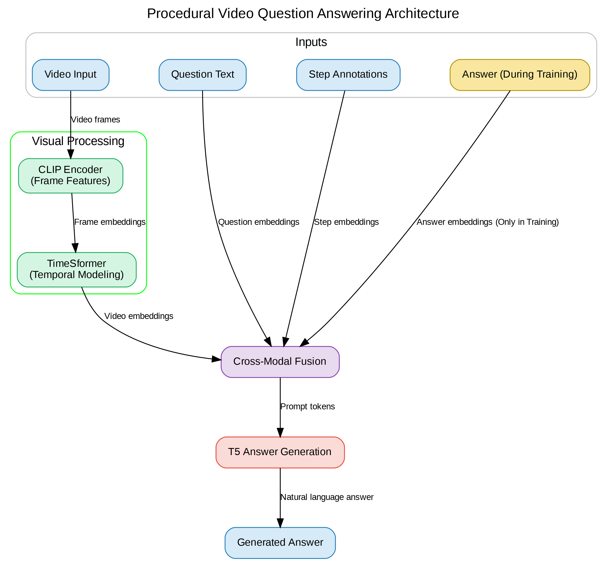

## Project Overview

This repository implements a full pipeline for procedural video question answering, from raw videos to temporal modeling, cross-modal fusion, and T5-based answer generation, along with visualization and evaluation utilities.

### Pipeline Stages
- **Dataset splitting (`dataset_split.py`)**: Creates stratified train/validation/test JSON splits from `StepsQA.json` and verifies video coverage.
- **CLIP feature extraction (`clip_feature.py`)**: Samples video frames adaptively around annotated steps, extracts CLIP image embeddings, and optionally visualizes sampling statistics.
- **Temporal modeling with TimeSformer (`timesformer_modeling.py`)**: Trains a TimeSformer model on CLIP features to produce temporal embeddings and saves per-split temporal feature files.
- **Temporal analysis and visualization (`timesformer_visualization.py`)**: Visualizes TimeSformer attention, temporal embedding structure (t-SNE/PCA), and training curves from TensorBoard logs.
- **Temporal evaluation (`timesformer_evaluation.py`)**: Evaluates temporal embeddings for intra/inter-class consistency and alignment with procedural step boundaries.
- **Cross-modal fusion (`cross_model_fusion.py`)**: Trains a contrastive video–text fusion model that produces prompt tokens for T5, with attention visualizations and early stopping.
- **Answer generation with T5 (`t5_answer_generation.py`)**: Uses frozen cross-modal prompts plus T5 to generate natural-language answers for video QA, with rich evaluation metrics and logging.
- **Shared utilities (`utils.py`)**: Common helpers for logging, seeding, data loading, metrics, visualization, experiment management, and early stopping.

### Pipeline Architecture

*High-level flow from raw videos to answer generation.*